# Active Directory Password Spray Detection & SOC Response Lab

> **Project Type:** Detection Engineering / SOC Analysis / Active Directory Security  
> **Environment:** Windows Server Active Directory + Windows 11 Client + Kali Linux + Splunk Enterprise  
> **Primary Scenario:** Detect, investigate, alert on, and contain an Active Directory password-spray attack.

---

## 1. Project Overview

This project simulates a realistic Security Operations Center (SOC) investigation of an Active Directory password-spray attack.

The goal was not simply to generate failed logins. The project follows an end-to-end SOC workflow:

**Attack → Telemetry → Detection → Alert → Investigation → Containment → Validation → Documentation**

 Ten test users were created in an Active Directory Domain Controller using a powershell script and all the users were given the same password. A Kali Linux host was used to generate authentication attempts against the domain controller. Windows Security logs were collected and forwarded to Splunk, which was hosted on an Ubuntu Server. SPL queries were developed to identify password-spray behavior involving multiple user accounts, and create alerts to recognize another spray.

The project also demonstrates a defensive response by blocking the attack source IP at the Windows Firewall and validating that subsequent authentication attempts were unsuccessful.

---

## 2. Objectives

- Build a small Active Directory lab.
- Join a Windows 11 client to the domain.
- Create test accounts specifically for security testing.
- Generate controlled password-spray activity from Kali Linux.
- Collect Windows Security authentication telemetry in Splunk.
- Identify Windows Event IDs associated with authentication failures and successes.
- Develop a password-spray detection.
- Create Splunk alerts for suspicious authentication activity.
- Investigate the affected accounts and source IP.
- Perform containment by blocking the attack source.
- Validate that the containment control worked.
- Document the incident as a SOC analyst would.

---

## 3. Lab Architecture
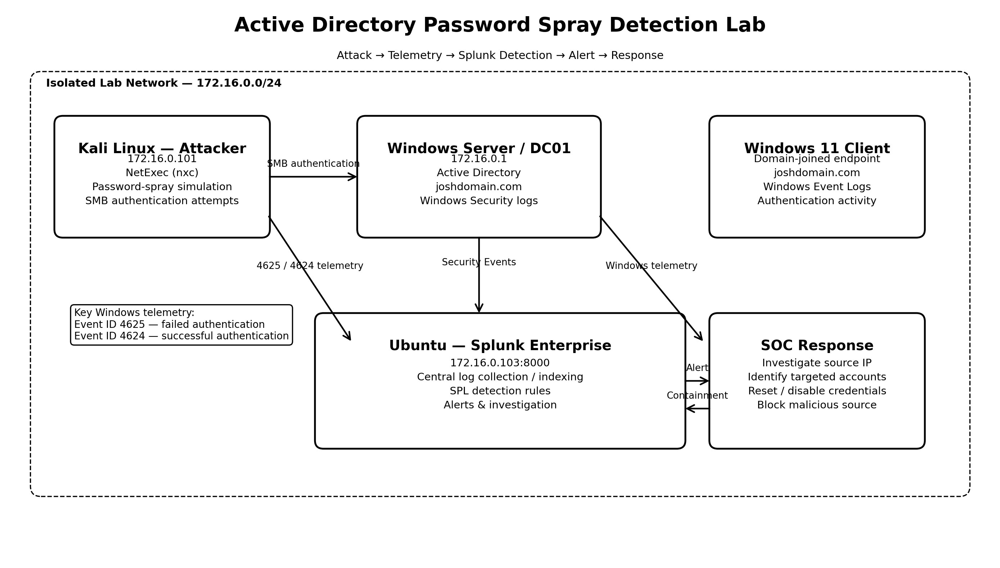

### Core Systems

| System | Role | Example IP |
|---|---|---|
| DC01 | Active Directory Domain Controller | `172.16.0.1` |
| Windows 11 | Domain-joined endpoint | `172.16.0.100` |
| Kali Linux | Attack simulation host | `172.16.0.101` |
| Splunk | SIEM / detection platform | `172.16.0.103` |


---

# 4. Active Directory Environment

## 4.1 Domain Controller

The first phase was building the Windows Server domain controller and establishing the lab network. The internal IP address was changed to a more private network address - 172.16.0.1. I renamed both ethernet adapters to Internal and External. A domain forest called 'joshdomain.com' was added. The next phase was creating an OU in the domain, and generating a test user with admin privileges.
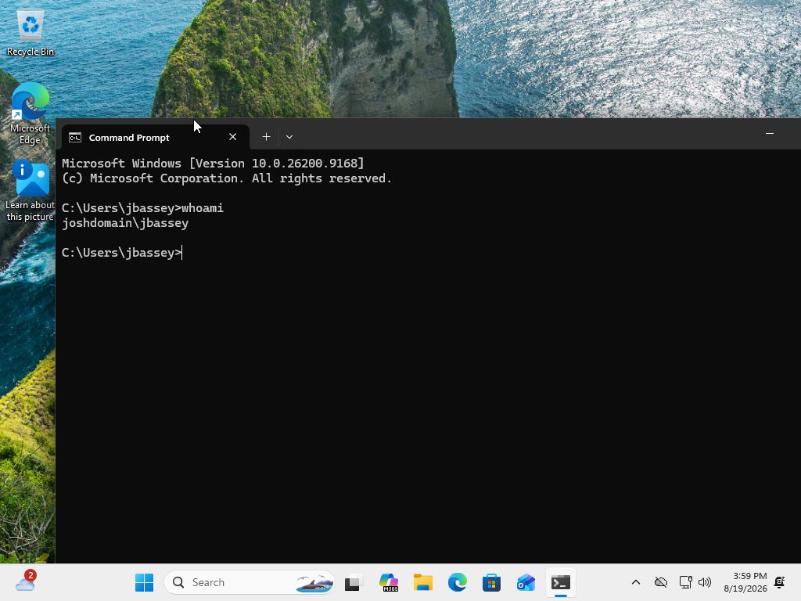

The next phase was configuring Remote Access on the D.C. The einternal ethernet adapter was used to provide clients access to the internal internet. I then configured the DHCP server to provide ip addresses to clients on the network, and set an IP address scope of 172.16.0.100-200.
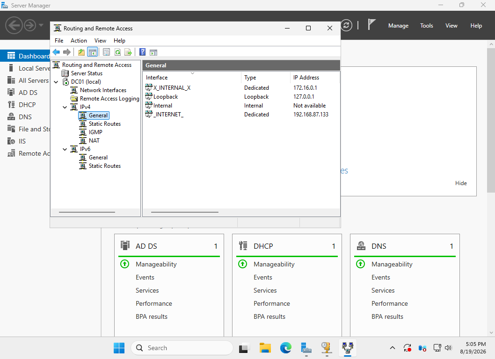

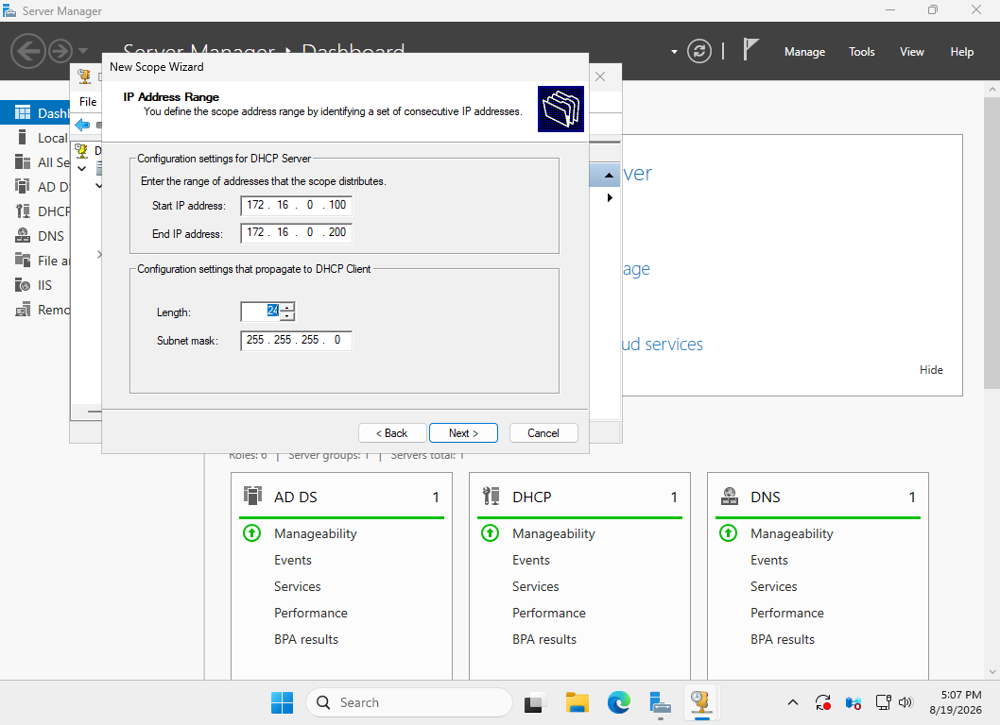

**Evidence:** `screenshots/dc01.ip.address.range.png`

The domain controller was configured for the `joshdomain.com` Active Directory environment.

---

## 4.2 Test User Accounts

A dedicated set of test accounts was created to safely simulate password-spray behavior.

Examples:

```text
spraytest1
spraytest2
spraytest3
spraytest4
spraytest5
spraytest6
spraytest7
spraytest8
spraytest9
spraytest10
```

These accounts were intentionally used instead of real users so that authentication testing could be performed without impacting legitimate accounts.

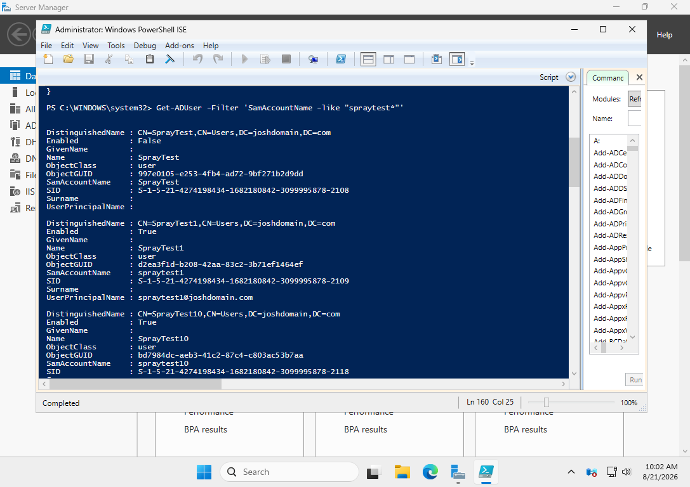

**Evidence:** `screenshots/spraytestgeneration.png`

---

# 5. Windows 11 Domain-Joined Client

A Windows 11 system was joined to the Active Directory domain.

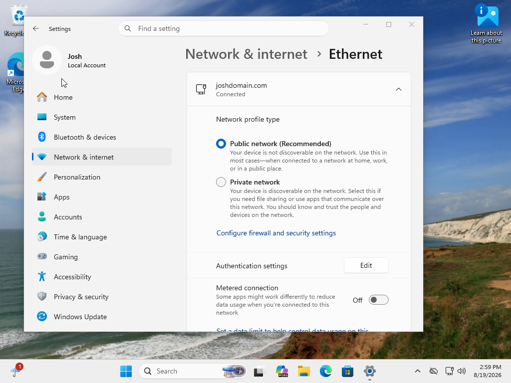

**Evidence:** `screenshots/Client_Part_Of_domain.png`

This provided an additional Windows endpoint for the lab and demonstrated the relationship between domain clients and the domain controller.

---

# 6. Splunk Log Collection

Windows Security logs were forwarded into Splunk and indexed under the `windows` index.

The primary telemetry used for the password-spray investigation was Windows Security authentication activity.

Important events included:

| Event ID | Meaning | SOC Relevance |
|---|---|---|
| `4625` | Failed logon | Primary password-spray telemetry |
| `4624` | Successful logon | Important for detecting successful compromise |
| `4672` | Special privileges assigned | Useful for privilege-related investigation |

---

## 6.1 Authentication Failure Telemetry

A failed authentication event was inspected to understand the fields available for detection.

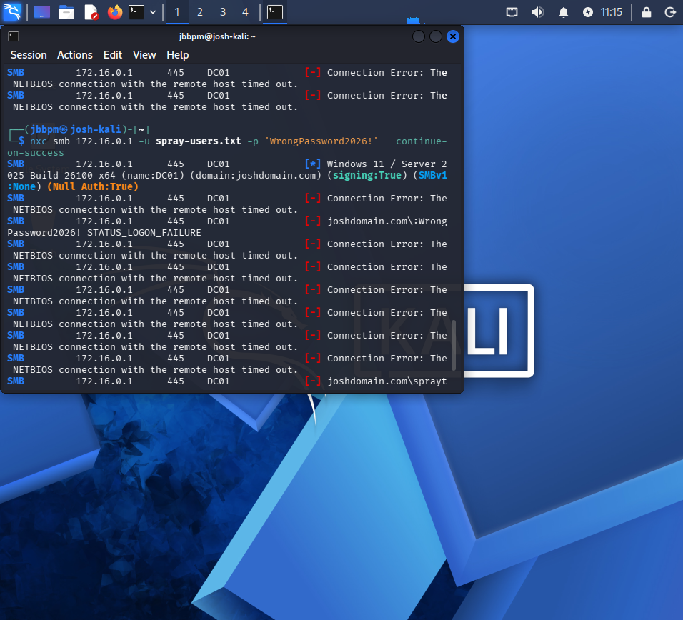

**Evidence:** `screenshots/Failed_PS.png`

Important fields included:

```text
EventCode
Account_Name
Source_Network_Address
Logon_Type
Authentication_Package
Failure_Reason
```

These fields allow the SIEM to correlate authentication failures by source IP and targeted account.

---

## 6.2 Authentication Success Telemetry

Successful authentication activity was also reviewed because a password spray is significantly more serious when one of the attempted credentials succeeds.

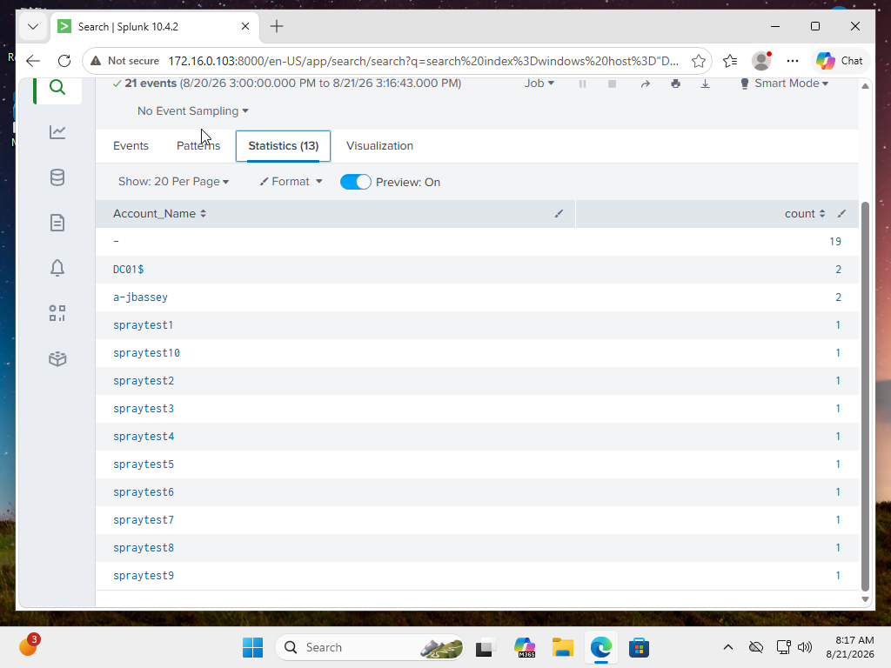

**Evidence:** `screenshots/Event4624_Affecting_the_spraytest_accounts.png`

Additional event details were inspected to understand the successful logon.

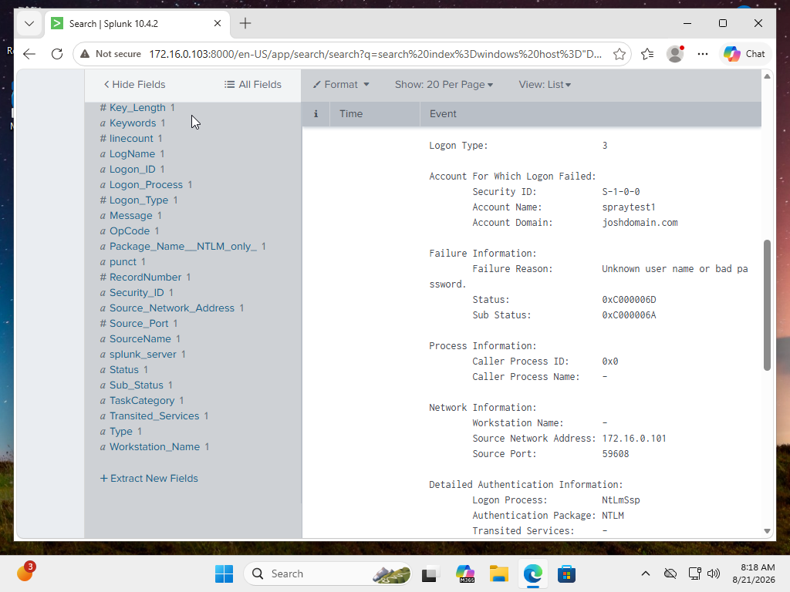

**Evidence:** `screenshots/Information_about_event4624.png`

---

# 7. Attack Simulation

## 7.1 Password Spray Simulation

Kali Linux was used to generate controlled SMB authentication attempts using netexec against the domain controller.

The goal was to reproduce a common password-spray pattern:

```text
One source IP
      ↓
Same password
      ↓
Many different domain accounts
```

This is different from a traditional brute-force attack, where many passwords are attempted against one account.

### Example attack command

```bash
nxc smb 172.16.0.1 -u spray-users.txt -p 'SpringLab2026!' --continue-on-success
```

> This command was executed only against the isolated lab environment.

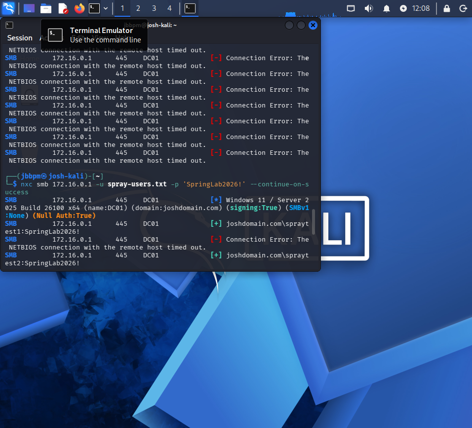

**Evidence:** `screenshots/jbbpmkali-2026-08-21-11-08-27.png`

---

## 7.2 Authentication Telemetry Generated by the Attack

The password-spray activity produced Windows authentication events that were subsequently visible in the Microsoft Windows logs, and more importantly in Splunk. 

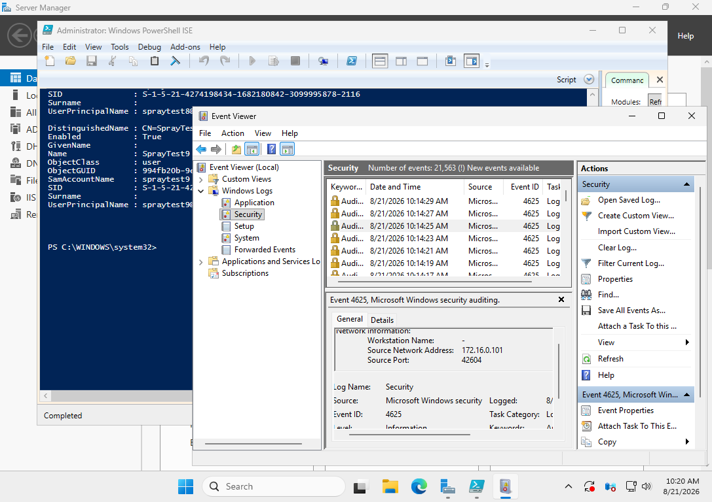

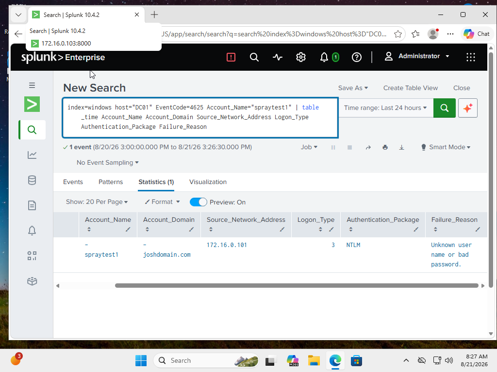

**Evidence:** `screenshots/spraytest1-log.png`

This demonstrates the full telemetry chain:

```text
Kali
 ↓
SMB authentication attempts
 ↓
DC01
 ↓
Windows Security Event 4625 / 4624
 ↓
Splunk
 ↓
Detection
```

---

# 8. Detection Engineering

## 8.1 Detection Logic

The core detection looks for:

1. Multiple authentication failures.
2. Coming from the same source IP.
3. Targeting multiple accounts.
4. Within a defined investigation window.

Conceptually:

```text
IF
    failed authentication count is high
AND
    distinct targeted accounts is high
AND
    source IP is the same
THEN
    generate password-spray detection
```

---

## 8.2 Password Spray Detection SPL

### Core detection logic

```spl
index=windows host="DC01" EventCode=4625
| stats count AS failures dc(Account_Name) AS distinct_users values(Account_Name) AS targeted_users by Source_Network_Address
| where distinct_users >= 5 AND failures >= 5
| eval detection="Potential Active Directory Password Spray"
| table Source_Network_Address failures distinct_users targeted_users detection
|sort - distinct_users
```
 
### What the search is doing

| SPL Component | Purpose |
|---|---|
| `EventCode=4625` | Finds failed authentication |
| `stats count` | Counts failures |
| `dc(Account_Name)` | Counts unique targeted accounts |
| `values(Account_Name)` | Displays affected accounts |
| `by Source_Network_Address` | Groups activity by attacker source |
| `where` | Applies detection threshold |
| `eval detection` | Labels the result |
| `table` | Produces analyst-friendly output |

---

## 8.3 Detection Result

The detection successfully identified the Kali source IP and multiple targeted accounts.

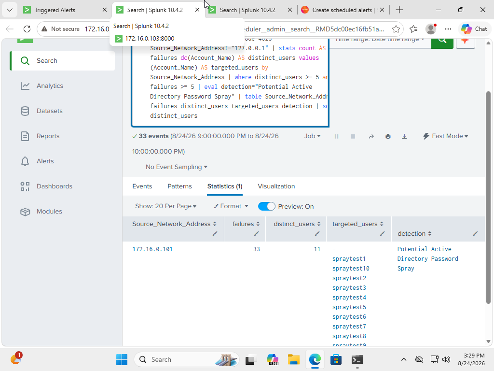

**Evidence:** `screenshots/Potential_Active_directory_spray.png`

An additional view of the detection results is included below.

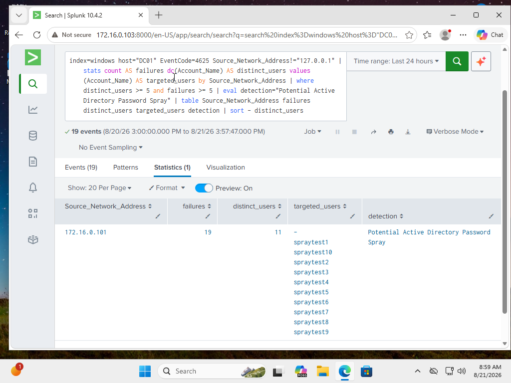

**Evidence:** `screenshots/potential-ad-spray.png`

Example investigation output:

```text
Source IP:       172.16.0.101
Failed logons:   19+
Distinct users:  11
Detection:       Potential Active Directory Password Spray
```

The key behavioral indicator is not simply the number of failed logons. It is the combination of **one source IP targeting many distinct accounts**.

---

# 9. Successful Password Spray Detection

A second detection was created to identify situations where authentication succeeded against one of the accounts targeted by the spray.

This is important because:

> A password spray with only failures represents an attempted attack.  
> A password spray followed by a successful authentication may represent account compromise.

## Example SPL

Use the successful authentication events to investigate accounts targeted by the spray:

```spl
index=windows host="DC01" EventCode=4624
| stats count by Source_Network_Address Account_Name
| sort - count
```

For a more focused investigation of the known lab source:

```spl
index=windows host="DC01" EventCode=4624 Source_Network_Address="172.16.0.101"
| stats count values(Account_Name) by Source_Network_Address
```

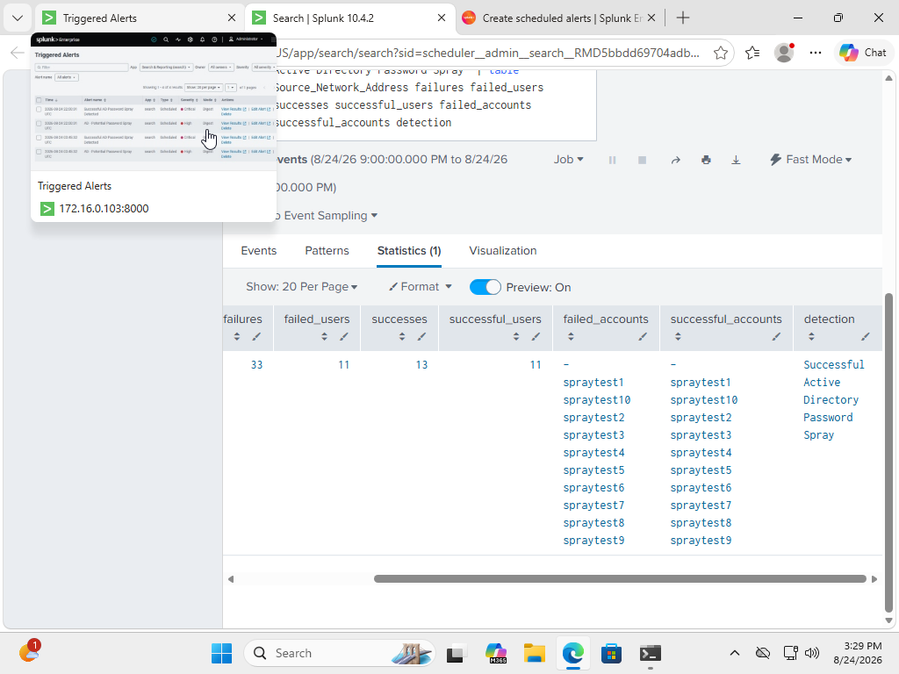

**Evidence:** `screenshots/Event4624_Affecting_the_spraytest_accounts.png`

---

# 10. Splunk Alerting

## 10.1 Password Spray Alert

The password-spray detection was converted into a scheduled Splunk alert.

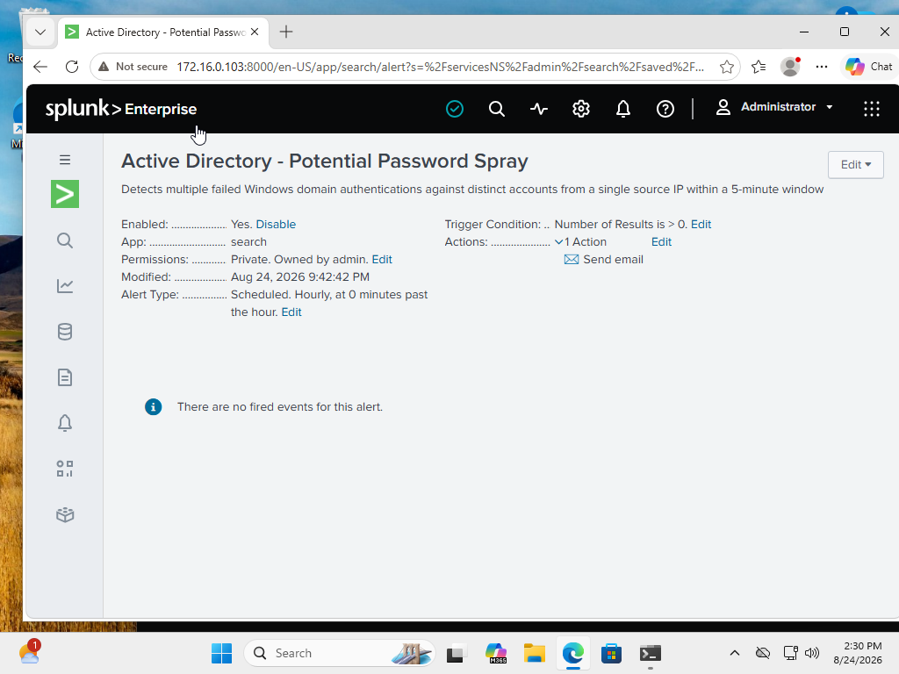

**Evidence:** `screenshots/Password_spray_aler_created.png`

### Alert configuration

```text
Alert name:
Active Directory - Potential Password Spray

Trigger:
Number of Results > 0

Severity:
High

Action:
Add to Triggered Alerts
```

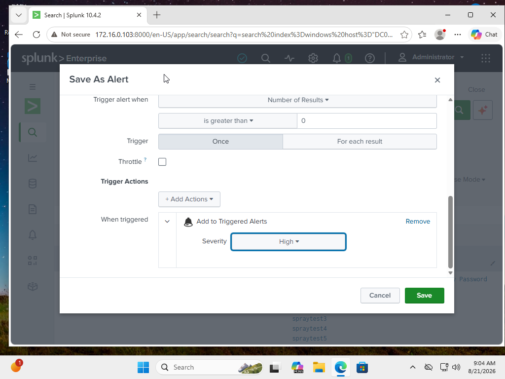

**Evidence:** `screenshots/high_severity.png`

---
### Triggered Alerts
The netexec smb commands were run again against the DC to test if splunk would detect the spray and trigger alerts. 2 different alerts, both for a successful and unsuccessful spray were generated in the activity block.

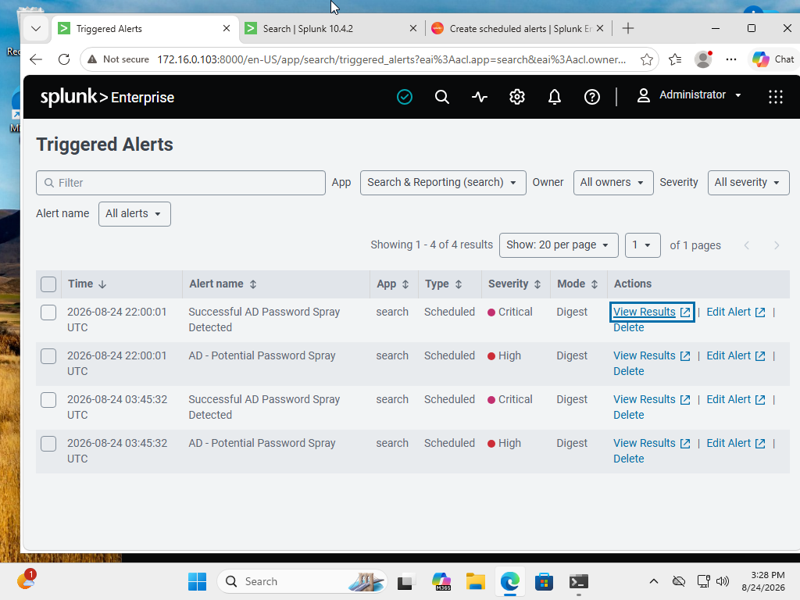

**Evidence:** `screenshots/Triggered_alerts.png`


--- 

## 10.3 Alert Design

The alert was designed around the output of the detection search rather than simply triggering on every individual failed authentication.
This reduces noise because one incorrect password does not automatically become a high-severity incident.
The behavioral threshold is what makes the alert meaningful.

---

# 11. SOC Investigation Workflow

When the alert fires, an analyst should investigate the following:

### Step 1 — Identify the source

```text
Source_Network_Address
```

Determine whether the source is:

- Known corporate endpoint
- Domain-joined workstation
- VPN address
- Administrator workstation
- Unknown/unmanaged system
- External/unauthorized host

---

### Step 2 — Identify targeted accounts

Review:

```text
Account_Name
```
Determine:
- How many accounts were targeted?
- Are privileged accounts involved?
- Are service accounts involved?
- Are normal user accounts involved?
- Are the accounts active?

---

### Step 3 — Determine attack pattern

Look for:

```text
Many users
      +
One source
      +
Same/similar password
      +
Short time window
```

This is strong evidence of password spraying.

---

### Step 4 — Check for successful authentication

Search Event ID `4624`.

```spl
index=windows host="DC01" EventCode=4624
| stats count values(Account_Name) by Source_Network_Address
```

A successful authentication from the suspicious source significantly increases the severity of the incident.

---

### Step 5 — Determine whether the account was privileged

Check whether the compromised account belongs to:

```text
Domain Admins
Administrators
Enterprise Admins
Other privileged groups
```

If privileged credentials were successfully used, escalate the incident immediately.

---

# 12. Incident Classification

### Example SOC classification

**Incident Type:** Credential Access / Account Compromise Attempt

**Technique:** Password Spraying

**MITRE ATT&CK:** `T1110.003 – Password Spraying`

**Initial Severity:** High

**Potential Impact:**

- Account compromise
- Unauthorized domain access
- Lateral movement
- Privilege escalation
- Data access
- Persistence

---

# 13. Containment

After identifying the malicious source IP, the source was blocked using Windows Defender Firewall.

The lab demonstrates a containment action rather than simply acknowledging the Splunk alert.

---

## 13.1 Firewall Containment

Example PowerShell:

```powershell
New-NetFirewallRule `
    -DisplayName "SOC - Block Password Spray Source 172.16.0.101" `
    -Direction Inbound `
    -RemoteAddress 172.16.0.101 `
    -Action Block `
    -Profile Any
```

The resulting firewall rule was verified.
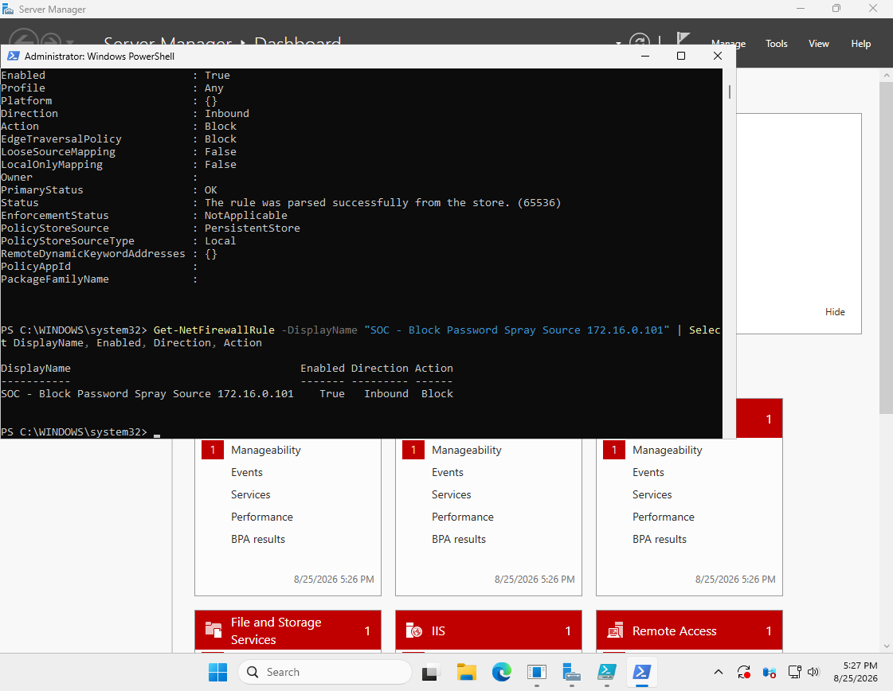
**Evidence:** `screenshots/ip_blocked.png`

The rule was confirmed as enabled and configured to block inbound traffic from the identified source.

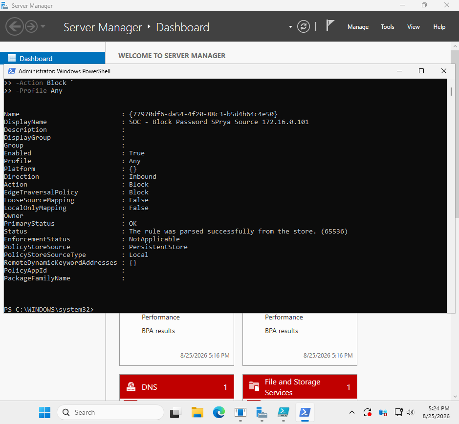

**Evidence:** `screenshots/Containment-block_ip.png`

---

# 14. Containment Validation
After blocking the source IP, another password-spray attempt was generated from Kali.

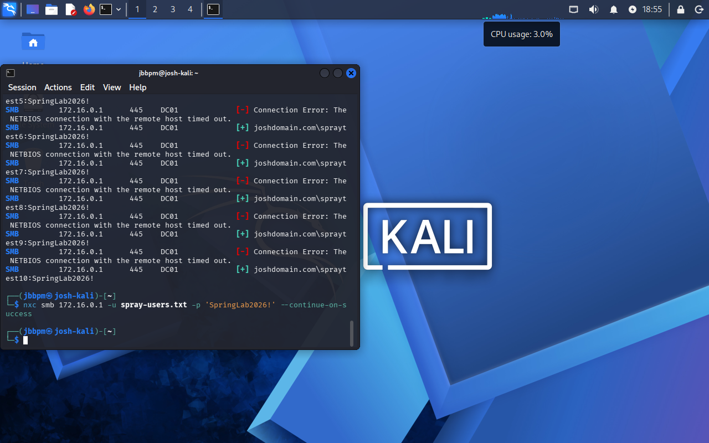

**Evidence:** `screenshots/Attempted_Password_Spray_After_BlockedIP.png`

Expected behavior:

```text
Before containment:

Kali
  ↓
Authentication
  ↓
DC01
  ↓
4625 / 4624
  ↓
Splunk detection

After containment:

Kali
  ↓
Firewall BLOCK
  X
DC01
```

This validates that the containment control prevented the attacker from continuing the authentication activity.

---

# 15. Remediation

Containment is not the same thing as remediation.

After blocking the source, the following actions should be considered.

## Immediate remediation

- Reset passwords for affected accounts.
- Disable accounts if compromise is suspected.
- Revoke active sessions/tokens where applicable.
- Review successful authentication events.
- Check privileged group membership.
- Search for lateral movement.
- Review endpoint activity associated with the source.
- Remove unauthorized firewall exceptions after the incident is resolved.

## Longer-term remediation

- Enforce strong password requirements.
- Enable MFA where possible.
- Implement account lockout/risk-based controls carefully.
- Monitor authentication failures by source and user.
- Reduce unnecessary external exposure of SMB.
- Restrict administrative access.
- Implement tiered administrative accounts.
- Improve SIEM correlation rules.

---

# 16. Detection Improvement Opportunities

The current detection is intentionally simple and demonstrates the basic behavior.

A production detection could be improved by adding:

### Risk-based thresholds

Different thresholds for:

```text
5 users / 5 failures
10 users / 10 failures
20 users / 20 failures
```

### Allowlisting

Exclude known:

- Vulnerability scanners
- Penetration-testing systems
- Identity-management systems
- Approved administrative infrastructure

### Account sensitivity

Increase severity if the targeted account is:

```text
Domain Admin
Enterprise Admin
Administrator
Service account
Privileged IT account
```

### Success correlation

Increase severity when:

```text
Password spray detected
        +
4624 from same source
        +
same targeted account
```

This would turn the detection into a stronger **possible account compromise** analytic.

---

# 17. Evidence Collection

The following evidence was captured during the project:

| Evidence | File |
|---|---|
| DC01 network/IP configuration | `dc01.ip.address.range.png` |
| Generated AD test users | `spraytestgeneration.png` |
| Windows 11 domain client | `Client_Part_Of_domain.png` |
| Kali attack simulation | `jbbpmkali-2026-08-21-11-08-27.png` |
| Failed authentication telemetry | `Failed_PS.png` |
| Microsoft authentication logs | `Microsoftlogs_showing_spray_attempt.png` |
| Event 4624 affected accounts | `Event4624_Affecting_the_spraytest_accounts.png` |
| Event 4624 details | `Information_about_event4624.png` |
| Password spray detection | `Potential_Active_directory_spray.png` |
| Additional detection view | `potential-ad-spray.png` |
| Password spray alert | `Password_spray_aler_created.png` |
| High severity alert configuration | `high_severity.png` |
| Firewall containment | `Containment-block_ip.png` |
| Blocked source verification | `ip_blocked.png` |
| Post-containment attack attempt | `Attempted_Password_Spray_After_BlockedIP.png` |

---

# 18. SOC Incident Report

## Incident Summary

**Incident:** Active Directory Password Spray

**Severity:** High

**Status:** Contained

**Detection Source:** Splunk

**Affected System:** DC01

**Attack Source:** `172.16.0.101`

**Technique:** Password Spraying

**MITRE ATT&CK:** `T1110.003`

### Executive Summary

A controlled password-spray attack was conducted against the lab Active Directory environment. The attack originated from a Kali Linux host and targeted multiple Active Directory accounts using a common password.

Windows Security authentication events were collected by Splunk. A detection correlated multiple failed authentication events from the same source IP against multiple distinct accounts.

The activity triggered a high-severity Splunk alert. The source IP was investigated and subsequently blocked using Windows Firewall. A second attack attempt was conducted after containment to validate that the firewall rule successfully prevented further authentication activity.

---

## Findings

### Finding 1 — Password Spray Detected

Multiple accounts were targeted from a single source IP.

**Evidence:**  


### Finding 2 — Authentication Telemetry Confirmed

Windows Security events provided the required source IP and account information.

**Evidence:**  


### Finding 3 — Successful Authentication Investigated

Event ID 4624 was reviewed to determine whether any spray attempt resulted in successful authentication.

**Evidence:**  


### Finding 4 — Source Contained

The identified source IP was blocked at the Windows Firewall.

**Evidence:**  


### Finding 5 — Containment Validated

A subsequent attack attempt was conducted after the source was blocked.

**Evidence:**  


---

# 19. Lessons Learned

This project demonstrated several practical SOC skills:

- Windows event analysis
- Active Directory security monitoring
- Authentication investigation
- SIEM search development
- SPL
- Detection engineering
- Alert creation
- Attack simulation
- Source attribution
- Incident triage
- Containment
- Firewall response
- Validation of security controls
- Incident documentation

The most important lesson was that detection alone is not enough.

A useful SOC workflow must connect:

```text
Telemetry
   ↓
Detection
   ↓
Alert
   ↓
Investigation
   ↓
Decision
   ↓
Containment
   ↓
Validation
   ↓
Remediation
   ↓
Documentation
```

---

# 20. Future Improvements

Future versions of this lab could include:

- Sysmon telemetry
- PowerShell detection
- Credential dumping detection
- Suspicious process creation
- Event log clearing
- Lateral movement detection
- Kerberoasting
- Pass-the-Hash
- Persistence detection
- Automated SOAR-style response
- Splunk dashboards
- Risk-based alert scoring
- MITRE ATT&CK mapping for every analytic

---

# 21. Project Takeaways

This lab goes beyond demonstrating that a SIEM can search logs.

It demonstrates the analyst's ability to:

> **Generate malicious behavior → understand the telemetry → write a detection → create an alert → investigate the alert → contain the threat → validate the response → document the incident.**

That is the workflow this project is intended to demonstrate.

---

# 22. Author

**Joshua Bassey-Duke**

Information Technology — University of Missouri

Cybersecurity / SOC / Detection Engineering Portfolio

GitHub: [Github](https://github.com/JOSHCODES-MIZ/Cybersecurity-portfolio.git)

LinkedIn: [LinkedIn](https://www.linkedin.com/in/joshuabassey-duke/)

-
